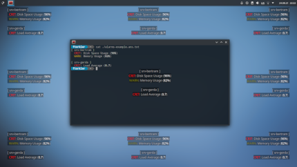

[](#)

# x11-overlay

[](#)
[](#)

This is a tiny program that displays the content of text files as an overlay on your desktop.  
Its goal is simplicity, a non-distracting visualization and especially it should not interfere with user interactions targeting the underlying content.

It is designed as a front-end tool to show alarms or the health status of any system. To do so, just write your custom script that generates and updates a text file with the information you want to be displayed. Use this file as input for `x11-overlay` and that's it.
But of course, it's absolutely not limited to alarming dashboards. Be creative! 

<p float="left">
  <a href="https://github.com/ftorkler/x11-overlay/raw/main/docs/scrsht-01-orientations.png"></a>
  <a href="#"></a>
</p>

## Features

* Simple and easy to use text input files (WYSIWYG)
* Don't disturb (not in taskbar nor in task-switcher)
* Don't interfere (delegate all user interactions to underlying elements)
* Screen selection for multi-monitor setup
* Colorized text with Ansi Escape Sequences.  
Supported are the well known color formats for 3-4bit, 8bit and 24bit (see [SGR](https://en.wikipedia.org/wiki/ANSI_escape_code#SGR_(Select_Graphic_Rendition)_parameters "Select_Graphic_Rendition")).

## Installation

### Dependencies

debian/ubuntu:

```
$> apt install libx11-dev libxfixes-dev libxrandr-dev libxft-dev libfreetype-dev
```

arc/manjaro:

```
$> pacman -S libx11 libxfixes libxrandr libxft freetype2
```

### Compile

```
$> make && ./bin/run_tests
```

## Usage

```
usage: overlay [OPTIONS] <INPUT_FILE>

  -c, --config=FILE      file path to read configuration from
  -h, --help             prints this help text
  -v, --verbose          be verbose and print some debug output

Positioning:
  -e PIXEL               screen edge spacing in pixels; defaults to '0'
  -l PIXEL               line spacing in pixels; defaults to '0'
  -m INDEX               monitor to use; defaults to '0'
  -o ORIENTATION         orientation to align window and lines; defaults to 'NW'
                         possible values are N, NE, E, SE, S, SW, W, NW and CENTER

Font:
  -f, --font-name=FONT   font name; defaults to 'NotoSansMono'
  -s, --font-size=SIZE   font size; defaults to '12'

Colors:
  -p, --profile=PROFILE  profile for ansi colors; values are VGA or XP
      --fg-color=COLOR   foreground color; defaults to '[97m' (equals '[38;2;255;255;255m')
      --fg-alpha=ALPHA   foreground alpha; defaults to '200'
      --bg-color=COLOR   background color; defaults to '[40m' (equals '[48;2;0;0;0')
      --bg-alpha=ALPHA   background alpha; defaults to '100'

Behavior:
  -d, --dim=PERCENT      dim the text on mouse over; defaults to '75'%
  -D PERCENT             dim the text in general; defaults to '0'%
  -t PIXEL               pixel tolerance for mouse over dimming; defaults to '0'
```

### Fonts

The overlay tool uses the FreeType font rasterizer to render fonts. Therefore all available fonts on your system can be listed using the fontconfig tools (e.g. `fc-list`).  

So here is an example how to display the project's ansi logo as an overlay:
* install a nice looking mono space font that supports charset `CP437` (e.g. a classic IBM font from [int10h.org](https://int10h.org/oldschool-pc-fonts/fontlist/?1))
* find out the correct name of the (new) installed font  
`$> fc-list | grep -i "IBM"`  
`/usr/local/share/fonts/m/Mx437_IBM_VGA_8x16.ttf: Mx437 IBM VGA 8x16:style=Regular`
* start overlay using specific font  
`$> ./bin/overlay -f "Mx437 IBM VGA 8x16" docs/logo.utf8.ans`
[](#)

# x11-overlay

[](#)
[](#)

This is a tiny program that displays the content of text files as an overlay on your desktop.  
Its goal is simplicity, a non-distracting visualization and especially it should not interfere with user interactions targeting the underlying content.

It is designed as a front-end tool to show alarms or the health status of any system. To do so, just write your custom script that generates and updates a text file with the information you want to be displayed. Use this file as input for `x11-overlay` and that's it.
But of course, it's absolutely not limited to alarming dashboards. Be creative! 

<p float="left">
  <a href="https://github.com/ftorkler/x11-overlay/raw/main/docs/scrsht-01-orientations.png"></a>
  <a href="#"></a>
</p>

## Features

* Simple and easy to use text input files (WYSIWYG)
* Don't disturb (not in taskbar nor in task-switcher)
* Don't interfere UI (delegate all user interactions to underlying elements)
* Screen selection for multi-monitor setup
* Colorized text with Ansi Escape Sequences.  
Supported are the well known color formats for 3-4bit, 8bit and 24bit (see [SGR](https://en.wikipedia.org/wiki/ANSI_escape_code#SGR_(Select_Graphic_Rendition)_parameters "Select_Graphic_Rendition")).

## Installation

### Dependencies

debian/ubuntu:

```
$> apt install libx11-dev libxfixes-dev libxrandr-dev libxft-dev libfreetype-dev
```

arc/manjaro:

```
$> pacman -S libx11 libxfixes libxrandr libxft freetype2
```

### Compile

```
$> make && ./bin/run_tests
```

## Usage

```
usage: overlay [OPTIONS] <INPUT_FILE>

  -c, --config=FILE      file path to read configuration from
  -h, --help             prints this help text
  -v, --verbose          be verbose and print some debug output

Positioning:
  -e PIXEL               screen edge spacing in pixels; defaults to '0'
  -l PIXEL               line spacing in pixels; defaults to '0'
  -m INDEX               monitor to use; defaults to '0'
  -o ORIENTATION         orientation to align window and lines; defaults to 'NW'
                         possible values are N, NE, E, SE, S, SW, W, NW and CENTER

Font:
  -f, --font-name=FONT   font name; defaults to 'NotoSansMono'
  -s, --font-size=SIZE   font size; defaults to '12'

Colors:
  -p, --profile=PROFILE  profile for ansi colors; values are VGA or XP
      --fg-color=COLOR   foreground color; defaults to '[97m' (equals '[38;2;255;255;255m')
      --fg-alpha=ALPHA   foreground alpha; defaults to '200'
      --bg-color=COLOR   background color; defaults to '[40m' (equals '[48;2;0;0;0')
      --bg-alpha=ALPHA   background alpha; defaults to '100'

Behavior:
  -d, --dim=PERCENT      dim the text on mouse over; defaults to '75'%
  -D PERCENT             dim the text in general; defaults to '0'%
  -t PIXEL               pixel tolerance for mouse over dimming; defaults to '0'
```

### Fonts

The overlay tool uses the FreeType font rasterizer to render fonts. Therefore all available fonts on your system can be listed using the fontconfig tools (e.g. `fc-list`).  

So here is an example how to display the project's ansi logo as an overlay:
* install a nice looking mono space font that supports charset `CP437` (e.g. a classic IBM font from [int10h.org](https://int10h.org/oldschool-pc-fonts/fontlist/?1))
* find out the correct name of the (new) installed font  
`$> fc-list | grep -i "IBM"`  
`/usr/local/share/fonts/m/Mx437_IBM_VGA_8x16.ttf: Mx437 IBM VGA 8x16:style=Regular`
* start overlay using specific font  
`$> ./bin/overlay -f "Mx437 IBM VGA 8x16" docs/logo.utf8.ans`

### Colors

The default foreground text color and the default background color can be set as regular ansi color code (see [SGR](https://en.wikipedia.org/wiki/ANSI_escape_code#SGR_(Select_Graphic_Rendition)_parameters "Select_Graphic_Rendition")). For convenience the heading ESC control character can be omitted for option parameters or in the configuration file.
The transparency of colors has to be set separately.
